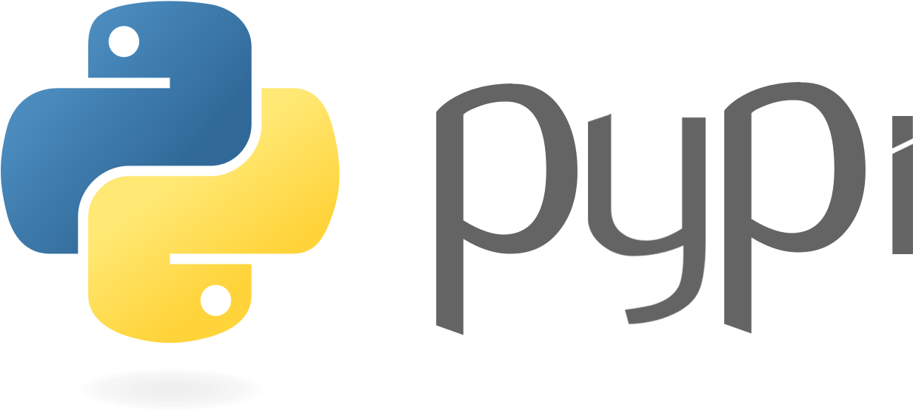

<h1 align="center">HELLO!</h1>

  

 

  <code>
  I'm Towhid Ahmed Foysal, a Competitive programmer and NLP researcher.I am a Software Engineer at Orbitax, which is one of the biggest International tax software Industries in the world. I have a great passion in <strong>Problem Solving and Natural Language Processing Research</strong>. </code>

 
 ✇ <b>Competitive Programmming</b>: 

 
<h2 align="center">ONLINE JUDGE</h2>

  
  
  
  
  

  
  
  
  
  

 

 
 ✇ <b>Research Area</b>: 

 
<h2 align="center">RESEARCH</h2>

  
   
  
  
    

 

 
 ✇ <b>Skills</b>: 

 

<h2>
  <code>
    Preferred Languages
  </code>
</h2>
 

  
  
  
  
  

 
<h2>
  <code>
    Integrated Development Environment(IDE)
  </code>
</h2>
 

  
  
  
  
  
  

<h2>
  <code>
    Database
  </code>
</h2>
 

 
 
 

<h2>
  <code>
    Tools Used
  </code>
</h2>

 
 
 
 

 

 
 ✇ <b>Current Status</b>: 

 
- 🌱 I’m currently working on <code>Natural Language Processing Toolkit (sbnltk) and in orbitax Bangladesh Limited </code>  
- 🤠I’m looking for help in <code>Bangla Corpus Collection </code>  
- 📫 I'm learning <code>c#,dotnet,angular,...</code>  
- 👯 I’m looking to collaborate on <code> Bangla NLP toolkit(sbnltk) </code>  
- 🕸️ Ask me about <code> Problem Solving and Deep learning </code>  
- 🌀 Trying to blog at <code> github </code>  
- 💬 You can reach me <code> towhidfoysal123@gmail.com </code>  
- ⚡  Gaming: COD, PUBG ,Valorant and Fall Guys

 
 ✇ <b>My Github Stats</b>: 

 

  
  

 

 
 ✇ <b>Publications</b>: 

 

 1. <a href="https://ieeexplore.ieee.org/document/9667900"> Bangla Extractive Text Summarization </a>

